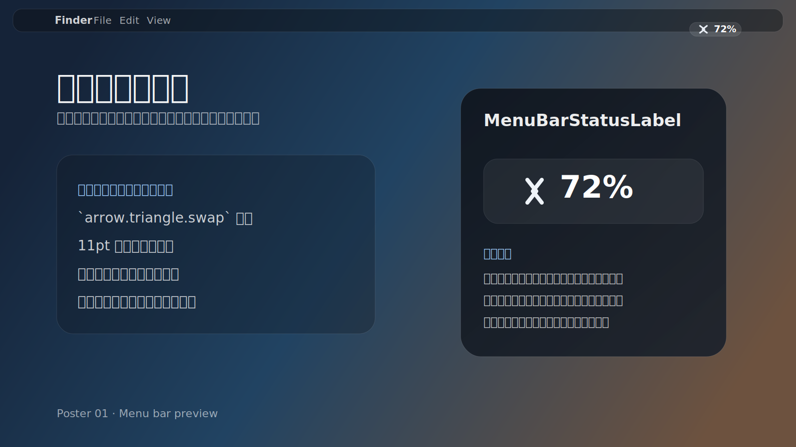
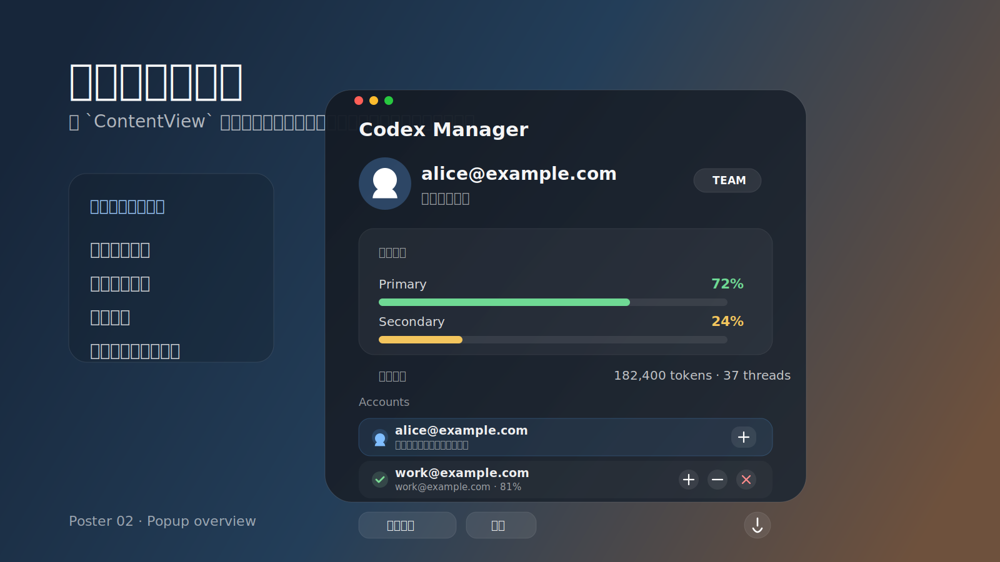

# Codex Manager

中文 | [English](#english)

`Codex Manager` is a macOS menu bar app for managing multiple local Codex / ChatGPT account profiles with isolated `CODEX_HOME` directories.




## 中文

### 这是什么

`Codex Manager` 是一个 macOS 菜单栏应用，用来管理本机多个 Codex / ChatGPT 账号配置。

它的重点不是“多开”或者“轮换”，而是把每个账号的本地环境隔离保存，并在需要时安全切换当前正在使用的账号。

适合这些场景：

- 你有多个 Codex / ChatGPT 账号，需要在同一台 Mac 上切换
- 你不想手动备份、覆盖 `~/.codex/auth.json`
- 你希望每个账号都有独立的本地配置目录，避免互相污染
- 你想快速查看当前账号、剩余额度和本机使用估算

它不会做这些事情：

- 不会自动轮换账号
- 不会绕过 Codex 限制
- 不会导出、共享或上传你的敏感认证信息

### 核心能力

- 菜单栏显示当前激活账号
- 导入当前已登录账号为可管理 profile
- 添加多个本地隔离账号
- 一键切换当前使用中的账号
- 读取本地可访问的 Codex app-server 额度信息
- 显示基于本机 SQLite 的 token / 会话估算
- 快速打开应用数据目录，便于备份和排查

### 工作方式

每个受管理账号都会保存在独立目录：

`~/Library/Application Support/Codex Manager/Profiles/<profile-id>/codex-home/`

系统当前实际使用的认证文件仍然是：

`~/.codex/auth.json`

当你在应用里切换账号时，应用会：

1. 先把当前账号的 `auth.json` 同步回它自己的隔离目录
2. 再把目标账号的 `auth.json` 原子写回 `~/.codex/auth.json`
3. 如果 Codex 桌面版正在运行，尝试自动重启桌面端，减少切换后的状态不一致

### 界面说明

主弹窗包含这些区域：

- 当前账号信息
- 剩余额度卡片
- 本机估算
- 已托管账号列表
- 导入当前账号
- 设置

额度条颜色规则：

- 大于 `50%`：绿色
- `30% - 50%`：蓝色
- `10% - 29%`：黄色
- 小于 `10%`：红色

“本机估算”来自这台 Mac 本地的 Codex SQLite 数据，不等于官方剩余额度。它更适合帮助你判断“最近这台机器用了多少”，不适合作为官方配额判断依据。

### 如何使用

#### 1. 启动应用

应用启动后会常驻在 macOS 菜单栏中。

#### 2. 导入当前账号

如果你当前的 `~/.codex/auth.json` 已经登录了某个账号，可以点击 `导入当前`，把它保存为一个可管理 profile。

#### 3. 添加新账号

点击右上角 `+`：

- 会弹出原生 sheet
- 点击 `登录`
- 按提示完成账号登录
- 登录完成后，这个账号会被保存为新的隔离 profile

如果勾选了“添加后立即切换”，登录完成后会自动切换过去。

#### 4. 切换账号

在账号列表里点击切换按钮即可。

如果 Codex 桌面版正在运行，应用会提示并尝试自动重启。

#### 5. 打开数据目录

在设置页点击路径行，会直接在 Finder 中打开对应目录。

### 隐私与安全

- 敏感认证信息只保存在本机
- `profiles.json` 只保存非敏感元数据
- 各账号的 `auth.json` 保存在各自隔离目录中
- 切换写入采用原子替换，尽量避免中途损坏

### 构建与运行

项目使用：

- Swift 5.9
- Swift Package Manager
- macOS 13+

本地开发构建：

```bash
swift build
```

运行自测：

```bash
swift run CodexManagerSelfTest
```

直接运行调试版本：

```bash
.build/debug/CodexManager
```

生成 `.app`：

```bash
bash scripts/build-app.sh
```

生成结果：

`./.build/Codex Manager.app`

### 分发与 GitHub Release

如果你要把应用发给别人，推荐直接使用 GitHub `Releases`。

仓库已经内置基于 tag 的自动发布流程：

```bash
git tag v0.1.0
git push origin v0.1.0
```

推送后 GitHub Actions 会：

1. 在 macOS runner 上构建 release 版本
2. 打包生成 zip
3. 自动创建对应的 GitHub Release
4. 把产物附加到 Release 中

打包脚本也可以在本地手动执行：

```bash
bash scripts/package-app.sh
```

本地产物包括：

- `./.build/Codex Manager.app`
- `./.build/CodexManager-<version>-macOS.zip`

### 关于 GitHub Packages

这个项目当前不单独发布 GitHub `Packages`。

原因很简单：

- 这是一个 macOS App，主要分发形式是 `.app` 和 `.zip`
- 如果只是代码复用，Swift 项目本身可以直接依赖这个仓库 tag
- 单独维护 GitHub Packages 对当前项目价值不大

### 给朋友使用时需要知道的事

当前默认是本地 ad-hoc 签名，不是 Apple Developer ID notarization。

所以第一次打开时，macOS 可能提示来源未验证。通常可以：

1. 右键应用
2. 选择“打开”
3. 再确认一次

如果以后要正式对外发布，建议补上：

- Developer ID 签名
- notarization

### 项目结构

- `Sources/CodexManagerApp`：SwiftUI app、窗口、视图和 view model
- `Sources/CodexManagerCore`：profile 存储、auth 文件切换、路径与服务逻辑
- `Sources/CodexManagerSelfTest`：不依赖 XCTest 的轻量自测
- `scripts/build-app.sh`：构建 `.app`
- `scripts/package-app.sh`：打包可分发 zip
- `scripts/generate-app-icon.swift`：生成 app 图标

### License

本项目按 `PolyForm Noncommercial License 1.0.0` 授权。

## English

### What It Is

`Codex Manager` is a macOS menu bar app for managing multiple local Codex / ChatGPT account profiles.

Its goal is not account rotation or bypassing usage limits. Instead, it keeps each account in an isolated local `CODEX_HOME` and lets you switch the active account safely when needed.

It is useful when:

- you use multiple Codex / ChatGPT accounts on the same Mac
- you do not want to manually copy `~/.codex/auth.json`
- you want each account to have its own isolated local environment
- you want a quick view of the active account, remaining quota, and local usage estimates

It does not:

- rotate accounts automatically
- bypass Codex limits
- export, upload, or share your sensitive auth data

### Features

- Menu bar status for the active account
- Import the currently logged-in account into managed profiles
- Add multiple isolated local accounts
- One-click account switching
- Read locally available Codex app-server quota information
- Show token / session estimates from local SQLite data
- Open the app data directory for backup and troubleshooting

### How It Works

Each managed account is stored in its own directory:

`~/Library/Application Support/Codex Manager/Profiles/<profile-id>/codex-home/`

The system-wide active auth file remains:

`~/.codex/auth.json`

When you switch accounts, the app:

1. syncs the current account's `auth.json` back into its isolated profile directory
2. atomically writes the target account's `auth.json` into `~/.codex/auth.json`
3. attempts to restart the Codex desktop app if it is currently running

### UI Overview

The main popup includes:

- active account information
- quota card
- local usage estimate
- managed profile list
- import-current action
- settings

Quota bar colors:

- above `50%`: green
- `30% - 50%`: blue
- `10% - 29%`: yellow
- below `10%`: red

The local usage estimate comes from Codex SQLite data on this Mac. It is not the same as the official quota, and should only be treated as a local usage indicator.

### Usage

#### 1. Launch the app

The app runs from the macOS menu bar.

#### 2. Import the current account

If `~/.codex/auth.json` is already logged in, click `Import Current` to save it as a managed profile.

#### 3. Add a new account

Click the `+` button in the top-right corner:

- a native sheet opens
- click `Login`
- complete the account login flow
- the account is saved as a new isolated profile

If "switch immediately after adding" is enabled, the app switches to it automatically after login completes.

#### 4. Switch accounts

Use the switch button in the profile list.

If the Codex desktop app is running, the app warns you and attempts to restart it.

#### 5. Open the data directory

Click the path row in Settings to reveal the directory in Finder.

### Privacy and Security

- Sensitive auth data stays on your machine
- `profiles.json` stores only non-sensitive metadata
- Each account keeps its own isolated `auth.json`
- Auth file updates use atomic replacement to reduce corruption risk

### Build and Run

This project uses:

- Swift 5.9
- Swift Package Manager
- macOS 13+

Build locally:

```bash
swift build
```

Run the self-tests:

```bash
swift run CodexManagerSelfTest
```

Run the debug build directly:

```bash
.build/debug/CodexManager
```

Build the `.app` bundle:

```bash
bash scripts/build-app.sh
```

Output:

`./.build/Codex Manager.app`

### Distribution and GitHub Releases

For sharing the app, GitHub `Releases` is the recommended distribution path.

The repository includes a tag-based release workflow:

```bash
git tag v0.1.0
git push origin v0.1.0
```

After the tag is pushed, GitHub Actions will:

1. build the release on a macOS runner
2. package the app into a zip archive
3. create the matching GitHub Release
4. attach the build artifact to that Release

You can also package locally:

```bash
bash scripts/package-app.sh
```

Local outputs:

- `./.build/Codex Manager.app`
- `./.build/CodexManager-<version>-macOS.zip`

### About GitHub Packages

This project does not currently publish a separate GitHub `Packages` artifact.

That is intentional because:

- this repository primarily ships a macOS app
- the main distributable is a `.app` / `.zip`, not a package registry artifact
- if someone only needs the code, Swift Package Manager can depend on the repository tag directly

### Sharing With Other People

The app is currently ad-hoc signed locally and is not notarized with an Apple Developer ID.

That means macOS may warn users the first time they open it. In most cases they can:

1. right-click the app
2. choose `Open`
3. confirm once more

For a more formal public release later, you should add:

- Developer ID signing
- notarization

### Project Structure

- `Sources/CodexManagerApp`: SwiftUI app entry point, windows, views, and view models
- `Sources/CodexManagerCore`: profile storage, auth switching, paths, models, and services
- `Sources/CodexManagerSelfTest`: lightweight self-tests without XCTest
- `scripts/build-app.sh`: builds the `.app` bundle
- `scripts/package-app.sh`: packages a distributable zip
- `scripts/generate-app-icon.swift`: generates the app icon set

### License

Licensed under the `PolyForm Noncommercial License 1.0.0`.
